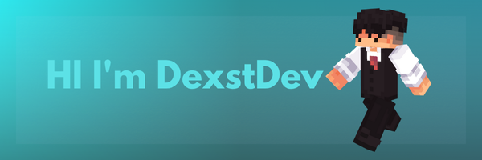

<h1 align="center">
      
    </a>
</h1>

  
  

  
  <!--Header Name-->
  #  ɪ'ᴍ DexstDev!

  *Digital Craftsman (Developer / Programmer)*
    

  <!--Start Intro-->               
  
I am a Full Stack Developer and Machine Learning Enthusiast with a huge love for Python, React.js, Node.js, Django, RDBMS, REST API and Data Visualization. 

